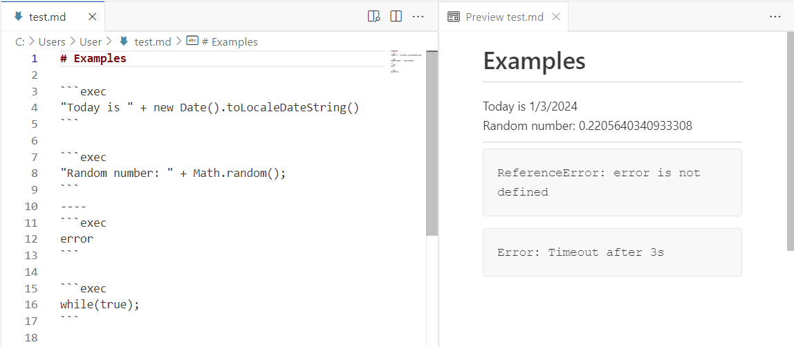

# Markdown Preview Exec

[](https://marketplace.visualstudio.com/items?itemName=alexandritesoftware.markdown-exec)

This extension is EXPERIMENTAL.

Markdown Preview Exec is a Visual Studio Code extension that enriches markdown preview with ability to execute JavaScript (ES5) code blocks.

## Usage

Executes the `exec` fenced code blocks:

~~~markdown
```exec
"Hello, <b>world</b>!";
```
~~~

The result is rendered in the preview:

> Hello, **world**!

Screenshot:



Other examples:

~~~markdown
```exec
require('/scripts/hello').print();
```
~~~

## Configuration

- `timeout` - timeout (in seconds) for the script to complete
- `include` - list of glob patters to include scripts from, relative to the first workspace folder

## Limitations

The default strict security profile of the markdown preview disables the `eval` functions. Therefore, the code is evaluated through [JS interpreter](<https://github.com/NeilFraser/JS-Interpreter>). This means that:

- Only JavaScript (ES5) is supported
- No access to the DOM and other browser APIs
- No access to the Node.js APIs
- Performance is slow (in comparison to the normal JS code execution)
- The script result should be searialisable to JSON (no object pasing from the sandbox)
- `require` is custom, supports only absolute paths from the worspace root folder

By selecting a different security profile, the code can be executed using eval, which enables modern JavaScript with access to the DOM. However, this approach is not recommended due to the associated security risks. Additionally, the sandboxed nature of the preview means that Node.js APIs, typically accessible to VS Code extensions, will remain unavailable.

Some of the limitations can be overcome:

- Code can be compiled to ES5 using [Babel](<https://babeljs.io/>)
- Some of the browser APIs can be made accessible through adapters

## TODO

- [x] Add configuration for include scripts from folders
- [x] Workaround for the infinite loops (i.e. limit execution time for 3 seconds)
- [ ] Provide access to some of the browser APIs (e.g. `console`, `document`, `window`, etc.)
